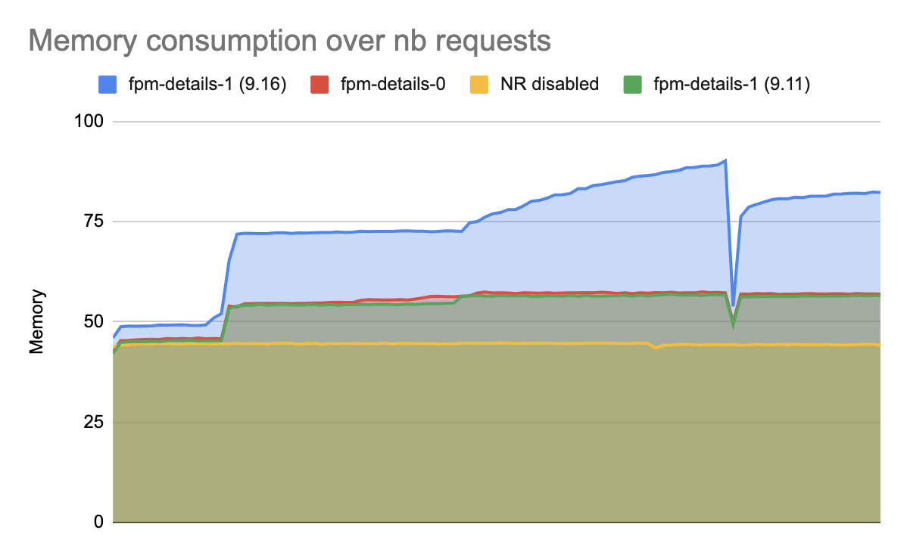

# NewRelic Memory Leak investigation

We identified an huge memory consumption in our Php application under particular conditions with NewRelic.
Also discussed [here](https://discuss.newrelic.com/t/php-agent-9-serious-memory-leak-issues/80863/56).
This code try to provide a minimal _step to reproduce_.

ℹ️ Should be fixed by this: https://github.com/newrelic/newrelic-php-agent/pull/123 (still waiting an official release to test it).

## Conditions
* Version `9.11` does not have the issue.
* Versions `9.12` to `9.16` have the issue.
* With `-dnewrelic.transaction_tracer.detail=0`, no more memory issue (default value is `1`).

## How to
First, build the docker image
```
make build
```

Then launch `php-fpm` with expected value for `transaction_tracer.detail`
```
NR_LICENSE=<your-license-key-here> make fpm-detail-0
```
or
```
NR_LICENSE=<your-license-key-here> make fpm-detail-1
```

:warning: If you forget to include `NR_LICENSE` NewRelic won't be enabled and results won't be relevant.

While FPM is running, in another terminal session, launch the memory test:
```
make memory-test
```
Lot of requests will be sent to `Php-Fpm` and memory consumption will be displayed during progress.
``` 
NewRelic Status:
X-Powered-By: PHP/7.4.15
Content-type: text/html; charset=UTF-8

newrelic loaded: true
newrelic.transaction_tracer.enabled: true
newrelic.transaction_tracer.detail: 0
====
Launching 100000 requests…
0%   31186944
1%   32583680
2%   32698368
…
96%   30523392
97%   30638080
98%   30515200
99%   30535680
```



## Notes

* Seems related to the callstack of exceptions, you can adjust/test parameters in [`myPage.php`](myPage.php)
* You can easily change the NR version by modifying the [`Dockerfile`](Dockerfile)
* type `make` for a description of available targets
* Opcache is *enabled* in production mode, be sure to reset it if you modify a file. If using provided makefile targets, reset is already done.
